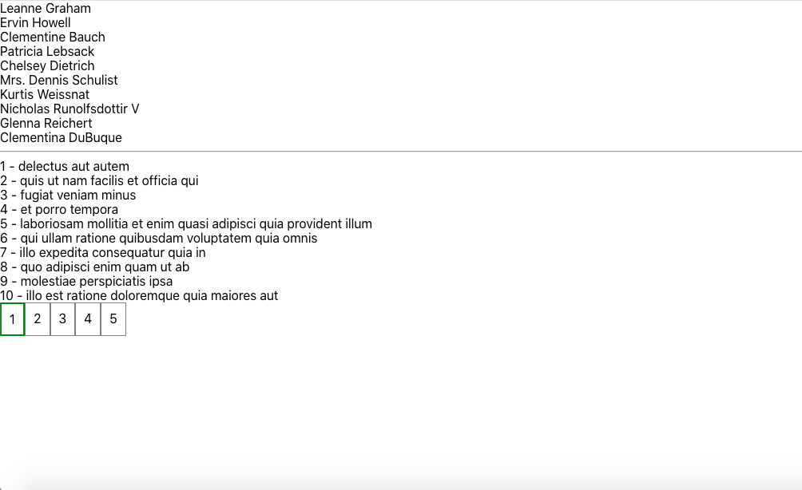
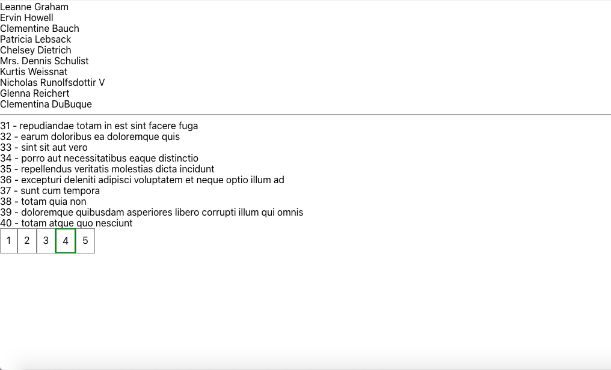

# Типизация Redux

Проект доступен по ссылке - https://react-redux-typescript-practice.vercel.app/ 

## Стек   

- React  
- Redux  
- Typescript  

В приложении для более удобной работы с Redux типизированы стейты, экшены, редюсеры, кастомные хуки (useTypedSelector)

Функционал приложения: в ответ за запрос сервер возвращает список пользователей и список дел. 

    

  

